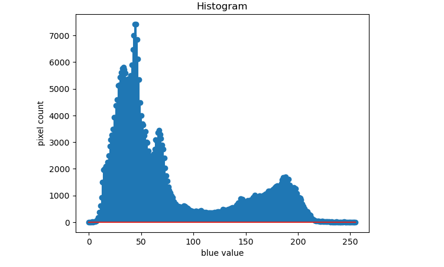

# Histogram and Histogram Equalization of an image
## Aim
To obtain a histogram for finding the frequency of pixels in an Image with pixel values ranging from 0 to 255. Also write the code using OpenCV to perform histogram equalization.

## Software Required:
Anaconda - Python 3.7

## ALGORITHM:
## Step 1:
Import the necessary libraries and read two images, Color image and Gray Scale image.

## Step 2:
Calculate the Histogram of Gray scale image and each channel of the color image.

## Step 3:
Display the histograms with their respective images.

## Step 4:
Equalize the grayscale image.

## Program:
```
# Developed By: KRISHNA PRAKAASH D M
# Register Number:212221230052
```

```
# FOR GRAY IMAGE
## code to read and show the input image
import cv2
import matplotlib.pyplot as plt
gray_image =cv2.imread('MESSI.PNG',0)
cv2.imshow('gray_image',gray_image) 
cv2.waitKey(0) 
cv2.destroyAllWindows()
```

```
# code to find the histogram of the image

hist = cv2.calcHist([gray_image],[0],None,[256],[0,255])
```


```
# Display the histogram graph of the image

plt.figure()
plt.title("Histogram")
plt.xlabel('grayscale value')
plt.ylabel('pixel count')
plt.stem(hist)
plt.show()
```

```
# code to perform histogram equalization of the image. 

equ_g = cv2.equalizeHist (gray_image)
```

```
# code to show histogram equalized image. 

cv2.imshow('EQUALIZED IMAGE',equ_g)
cv2.waitKey(0)
cv2.destroyAllWindows()

```
```
# code to find the histogram of the equalized image

equal_hist = cv2.calcHist([equ_g],[0],None,[256],[0,255])
```


```
# Display the equalized histogram graph of gray scale image

plt.figure()
plt.title("Histogram")
plt.xlabel('grayscale value')
plt.ylabel('pixel count')
plt.stem(equal_hist)
plt.show()
```

# FOR COLOR IMAGE:

```
# code to read and show the input image

import cv2
import matplotlib.pyplot as plt
color_image =cv2.imread('MESSI.PNG',-1)
cv2.imshow('color_img',color_image) 
cv2.waitKey(0) 
cv2.destroyAllWindows()

```
```
# code to calculate the histogram of different channels of color image

hist0 = cv2.calcHist([color_image],[0],None,[256],[0,255]) #channel 0 - blue
hist1 = cv2.calcHist([color_image],[1],None,[256],[0,255]) #channel 1 - green
hist2 = cv2.calcHist([color_image],[2],None,[256],[0,255]) #channel 2 - red

```
```
# Display the histogram graph of different channels of color image

#channel 0 - blue
plt.figure()
plt.title("Histogram")
plt.xlabel('blue value')
plt.ylabel('pixel count')
plt.stem(hist0)
plt.show()

#channel 1 - green
plt.figure()
plt.title("Histogram")
plt.xlabel('green value')
plt.ylabel('pixel count')
plt.stem(hist1)
plt.show()

#channel 2 - red
plt.figure()
plt.title("Histogram")
plt.xlabel('red value')
plt.ylabel('pixel count')
plt.stem(hist2)
plt.show()

```


# Output:
GRAY IMAGE

Input Grayscale Image


## Histogram of Grayscale Image


## Histogram Equalized Grayscale Image


## Equalized histogram of Grayscale Image


# COLORIMAGE
## Input color Image


## Histogram of different channels of color image



## Result: 
Thus the histogram for finding the frequency of pixels in an image with pixel values ranging from 0 to 255 is obtained. Also,histogram equalization is done for the gray scale image using OpenCV.
